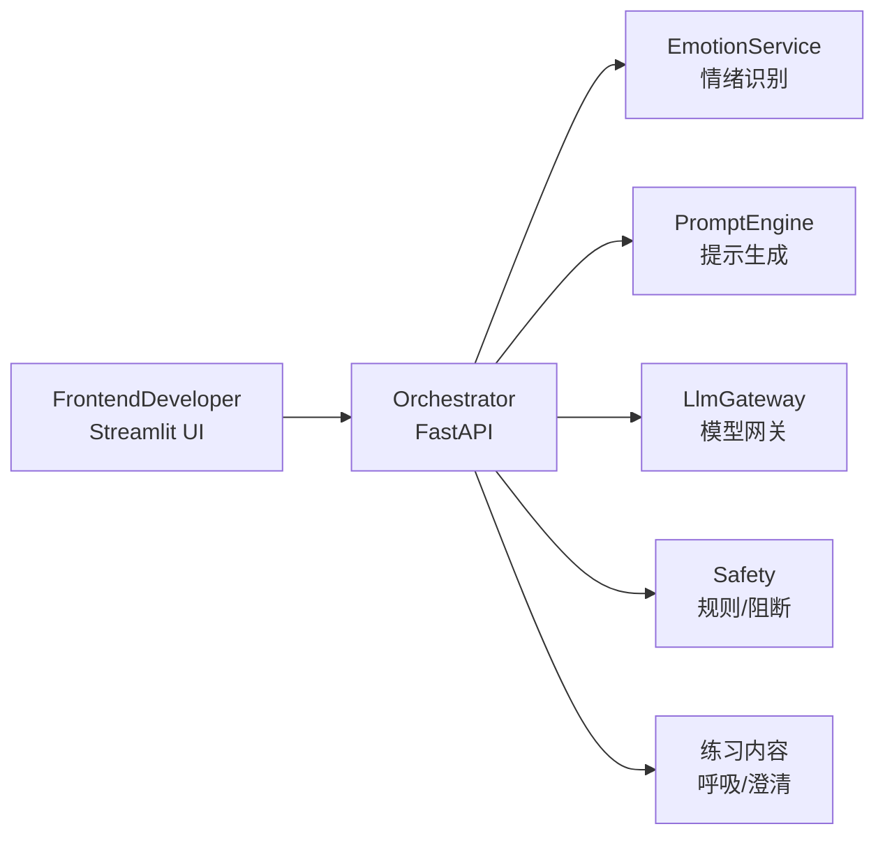
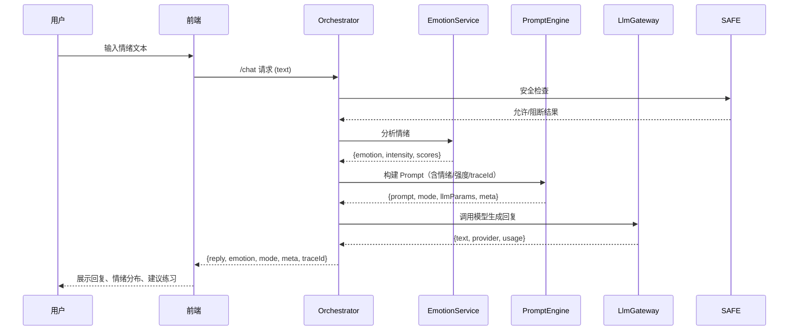

MindfulMentor 是一个“情绪觉察 + 安全回应”的轻量级多模块示例项目。

## Introduction
- 目标：作为一个 MVP，演示从“情绪输入”到“安全回复”的最小闭环，用户能得到共情回应、情绪可视化和简单练习建议。
- 价值：快速验证情绪识别 + 安全提示 + 多 Provider 网关的组合思路，为后续接入真实 LLM、扩展安全策略或换模型提供支点。
- 各模块意图：
  - EmotionService：用零样本分类识别主情绪与强度（1-4），为下游决定安全等级。
  - PromptEngine：按情绪强度选择高/常规模板与 LLM 参数，确保高风险场景的提示更温和。
  - LlmGateway：解耦模型供应商（mock/本地/云端），失败时自动回退，便于在不同环境演示。
  - Orchestrator：串起安全检查、情绪、提示、生成，输出统一结构与 traceId，方便调试。
  - FrontendDeveloper：以可视化方式展示回复、情绪分布和建议练习，方便非技术同学体验 MVP。
  - FrontendRelease：纯静态版前端发布目录，用于打包/演示。
- 使用场景示例：压力/焦虑自助对话、呼吸引导、思维澄清，附 traceId 便于调试与审计。

## 仓库结构与角色
- `EmotionService/`：独立 FastAPI 服务，`Core.py` 读入本地 HF 模型做零样本分类；`download_models.py` 预下载模型到 `.models/`，`App.py` 暴露 `/analyze`。
- `PromptEngine/`：基于情绪强度挑选模板，`Templates/NormalIntensity.txt` 与 `HighIntensity.txt` 定义语气；`Core.py` 产出 `{prompt, mode, llmParams, meta}`；`App.py` 暴露 `/prompt`。
- `LlmGateway/`：统一模型调用与回退，`Providers.py` 实现 mock/tiny-local/OpenAI 兼容调用，`Config.py` 读取 `.env`，`Core.py` 负责日志与 fallback，`App.py` 暴露 `/generate`。
- `Orchestrator/`：业务编排层，`Safety.py` 做关键词阻断，`Flows.py` 串安全→情绪→提示→生成并写入 `.logs/orchestrator.log`，`App.py` 暴露 `/chat`。
- `FrontendDeveloper/`：Streamlit 交互版（开发态），`App.py`/`Components/`/`Config.py` 构建 UI，便于快速调试。
- `FrontendRelease/`：无需构建的静态版 UI，`index.html` + `app.js` + `ui.js` + `api.js` + `config.js` + `styles.css` 直接跑，包含 API 调用与 mock 回退。
- `Docs/`：架构、接口等说明（`Arch.md`、`Interfaces.md`）。
- `scripts/`：启动/清理脚本（`StartAll.sh` 自动生成 `.env`、安装依赖并启动多服务）。

## 快速开始
- 前置：Python 3.10+，建议保持网络可下载依赖与模型。
- 首次需要创建虚拟环境（StartAll 会自动激活但不会新建）：
  ```bash
  cd path/to/MindfulMentor
  python3 -m venv .venv
  ```
- 运行前激活虚拟环境，终端前缀应看到 `(.venv)`：
  ```bash
  source .venv/bin/activate
  ```
- 模型配置：不需要手动建 `.env`，`StartAll` 首次运行会自动生成 `.env`（含 LLM 配置）。把真实的 `LLM_PROVIDER/LLM_API_KEY/LLM_BASE_URL/LLM_API_MODEL` 写到 `.env`；如果留空，会自动回退到玩具模型 `tiny-local` 并提示。
- 一键启动（包含依赖安装与端口准备）：
  ```bash
  cd path/to/MindfulMentor
  ./scripts/StartAll.sh
  ```
  - 默认前端为静态发布版（FrontendRelease）。若要切换为开发版 Streamlit UI，使用 `./scripts/StartAll.sh -d` 或 `FRONTEND_MODE=developer ./scripts/StartAll.sh`。用 `-r` 可显式指定回静态版。
  启动成功后浏览器访问 `http://127.0.0.1:8501`。
- 日志位于 `.logs/`（`StartAll` 会在启动前自动清理端口、旧进程与旧日志）。如果只想单独清理环境，可运行：
  ```bash
  ./scripts/ClearEnv.sh
  ```

## 名词速览
- 情绪识别：把输入文本映射为预设情绪标签（如 anxious/angry）及强度。
- Prompt：发给大模型的指令文本，通常包含角色、语气、限制等。
- Provider：大模型服务提供方或实现（OpenAI、DeepSeek、本地模型、mock）。
- Gateway：对不同 Provider 做统一封装/回退，让上游不关心底层差异。
- 编排（Orchestrator）：把多个内部服务串成业务流程，并做安全校验、错误包装。
- TraceId：每个请求的唯一标识，便于日志/链路排查。

## 架构图（模块关系）


## 流程图（数据流转）


## 设计要点
- 强解耦：各模块都能独立作为服务运行，Orchestrator 可通过 import 或 HTTP 方式编排。
- 安全第一：PromptEngine 对高强度情绪使用更温和的提示，Safety 模块做硬规则检测。
- LLM 网关预留多提供商，默认 mock 返回，后续可接入 OpenAI / DeepSeek。

## 主要接口
- EmotionService `/analyze`：文本 → 情绪标签/强度。
- PromptEngine `/prompt`：情绪 + 文本 → 安全 Prompt。
- LlmGateway `/generate`：Prompt → LLM 回复（可切换 provider）。
- Orchestrator `/chat`：统一给前端使用。

更多契约与调用链见 `Docs/Interfaces.md` 与 `Docs/Arch.md`。
各子模块（EmotionService / PromptEngine / LlmGateway / Orchestrator / FrontendDeveloper）都有各自的 `README.md`，详细说明职责、名词和接口。

## 协作 / 提交须知
仓库：https://github.com/RabbitEG/MindfulMentor

推荐协作步骤：
1) 克隆并进入仓库  
   ```bash
   git clone https://github.com/RabbitEG/MindfulMentor.git
   cd MindfulMentor
   ```
2) 创建个人功能分支  
   ```bash
   git checkout -b feature/<你的名字>-<改动名>
   ```
3) 开发前先同步主分支，减少后续冲突  
   ```bash
   git pull --rebase origin main
   ```
4) 开发与自测：按需运行 `./scripts/StartAll.sh`，确保依赖可装、服务可起。
5) 提交代码  
   ```bash
   git add .
   git commit -m "说明一下你改了啥"
   ```
6) 如开发时间较长或 push 提示落后，可在推送前再同步一次主分支  
   ```bash
   git pull --rebase origin main
   ```
7) 推送并发起 PR（主分支避免直接开发），推送前确认无敏感信息/临时文件；推荐至少每日或每个里程碑推送一次，避免积累过多改动  
   ```bash
   git push -u origin feature/<你的名字>-<改动名>
   ```
